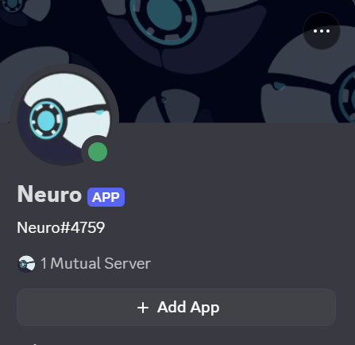
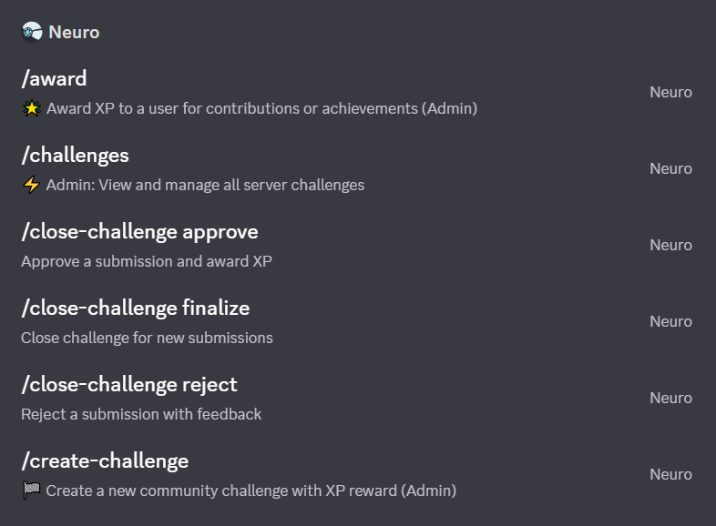

# 🧠 SOAI Neuro Core

**Production-ready Discord bot for School of AI Bejaia ESTIN community**

A comprehensive gamification system featuring XP progression, level roles, AI specialty tracking, weekly challenges, attendance rewards, and streak multipliers to drive engagement and learning in your AI community.

---

## 📸 Screenshots

### User Profile & Stats

*View your rank, level, XP progress, and stats with `/rank` or `/stats` commands*

### Commands in Action

*Easy-to-use slash commands for all bot features*

---

## ✨ Features

### 🎮 Core Gamification System
- **XP System:** Earn 15 XP per message (10+ characters, 30s cooldown)
- **Level Progression:** Exponential leveling with formula `100 × (Level ^ 1.5)`
- **6 Level Roles:** From ⚪ Neuron Seed (Level 1) to 🔥 Neuron Master (Level 30+)
- **Milestone Celebrations:** Automatic announcements for message, XP, and level milestones
- **Leaderboards:** Global and weekly rankings with pagination

### 🔥 Engagement Features
- **Daily Streaks:** 1.2x XP multiplier at 7+ consecutive days of activity
- **Weekly Challenges:** Admin-created challenges with XP rewards (10-100 XP)
- **Voice Attendance:** 40 XP for 30+ minutes in voice channels
- **Weekly Top Role:** Rotating recognition for most active members
- **AI Specialty Roles:** 8 field-specific roles via reaction selection

### 👑 Admin Controls
- **Permission System:** Role-based access control (Admin/Moderator/Staff or ManageGuild)
- **Challenge Management:** Create, close, approve, and reject submissions
- **XP Management:** Award or remove XP with audit logging
- **Dashboard Commands:** `/challenges` and `/submissions` for easy management

### 📊 User Commands
- `/rank` - View your rank, XP, and progress
- `/leaderboard` - See top players (paginated)
- `/weekly-top` - View weekly leaderboard
- `/streak` - Check your daily streak status
- `/stats` - Complete dashboard with all your stats
- `/tip` - Get random tips about the XP system
- `/help` - Full command guide
- `/quickstart` - Onboarding guide for new members

---

## 🛠 Tech Stack

- **Runtime:** Node.js 20+
- **Framework:** discord.js v14.21.0 (slash commands)
- **Database:** MongoDB + Mongoose 8.19.2
- **Scheduler:** node-cron 4.2.1
- **Environment:** dotenv 16.6.1

---

## 📋 Prerequisites

1. **Node.js 20+** - [Download](https://nodejs.org/)
2. **MongoDB** - [Install locally](https://www.mongodb.com/try/download/community) or use [MongoDB Atlas](https://www.mongodb.com/cloud/atlas)
3. **Discord Bot Token** - [Discord Developer Portal](https://discord.com/developers/applications)

---

## 🚀 Quick Start

### 1. Clone & Install
```bash
git clone <your-repo-url>
cd neuro
npm install
```

### 2. Configure Environment
Create `.env` file in root directory:
```env
DISCORD_TOKEN=your_bot_token_here
CLIENT_ID=your_bot_client_id
GUILD_ID=your_server_guild_id
MONGODB_URI=mongodb://localhost:27017/soai-neuro-core
```

### 3. Discord Developer Portal Setup
Enable these **Privileged Gateway Intents**:
- ✅ Server Members Intent
- ✅ Message Content Intent
- ✅ Presence Intent (optional)

**Bot Permissions (OAuth2 URL):**
- `applications.commands`
- `bot` (with Administrator permission for simplicity)

### 4. Create Discord Roles
Manually create these roles in your Discord server (exact names required):

**Level Roles:**
- `⚪ Neuron Seed`
- `🟢 Neuron Explorer`
- `🔵 Neuron Builder`
- `🟣 Neuron Researcher`
- `🟡 Neuron Architect`
- `🔥 Neuron Master`

**AI Specialty Roles:**
- `🧠 Deep Learning`
- `📊 Data Science`
- `🤖 Machine Learning`
- `⚙️ AI Engineering`
- `🗣 NLP`
- `🔍 Computer Vision`
- `🎮 Reinforcement Learning`
- `🧪 Research AI`

**Special Roles:**
- `Neuron of the Week`
- `🌟 Community Spark`
- `Event Participant`

### 5. Deploy Commands & Start Bot
```bash
# Deploy slash commands to Discord
npm run deploy

# Start the bot
npm start
```

**Success!** You should see:
```
[INFO] MongoDB connected
[INFO] Commands loaded | count:17
[INFO] Bot is online | tag:YourBot#1234
```

---

## 📁 Project Structure

```
neuro/
├── src/
│   ├── commands/          # 17 slash commands
│   │   ├── rank.js
│   │   ├── leaderboard.js
│   │   ├── award.js
│   │   ├── create-challenge.js
│   │   └── ...
│   ├── events/            # 7 event handlers
│   │   ├── ready.js
│   │   ├── interactionCreate.js
│   │   ├── messageCreate.js
│   │   ├── messageReactionAdd.js
│   │   └── ...
│   ├── services/          # 12 service modules
│   │   ├── xpService.js
│   │   ├── levelService.js
│   │   ├── streakService.js
│   │   ├── permissionService.js
│   │   └── ...
│   ├── models/            # 4 Mongoose schemas
│   │   ├── User.js
│   │   ├── XPLog.js
│   │   ├── Challenge.js
│   │   └── WeeklyStats.js
│   ├── config/
│   │   ├── index.js       # Environment config
│   │   └── roles.js       # Role definitions
│   ├── utils/
│   │   ├── logger.js
│   │   ├── mongo.js
│   │   └── ...
│   ├── deploy-commands.js # Command deployer
│   └── index.js           # Bot entry point
├── .env                   # Environment variables (gitignored)
├── package.json
└── README.md
```

---

## 🎯 How It Works

### XP & Leveling System
- **Earn XP:** 15 XP per message (10+ characters, 30-second cooldown)
- **Streak Bonus:** 7+ consecutive days = 1.2x multiplier (18 XP per message)
- **Challenge Rewards:** 10-100 XP based on difficulty
- **Voice Rewards:** 40 XP for 30+ minutes in voice channels
- **Level Formula:** `XP Required = 100 × (Level ^ 1.5)`

**Example Progression:**
- Level 1 → 2: 100 XP
- Level 5 → 6: 1,118 XP
- Level 10 → 11: 3,162 XP
- Level 20 → 21: 17,889 XP

### Milestone Triggers
**Message Milestones:** 10, 50, 100, 500, 1K, 2.5K, 5K, 10K  
**XP Milestones:** 100, 500, 1K, 2.5K, 5K, 10K, 25K, 50K, 100K  
**Level Milestones:** 5, 10, 15, 20, 25, 30, 40, 50

### Weekly Role Rotation
Every Monday at 00:00 UTC:
- Top XP earner gets "Neuron of the Week" role
- Most active member gets "🌟 Community Spark" role
- Previous week's roles are removed

---

## 🎮 Commands Reference

> 💡 **See commands in action:** Check the [screenshots above](#-screenshots)

### User Commands
| Command | Description |
|---------|-------------|
| `/rank` | View your rank, level, XP, and progress |
| `/leaderboard [page]` | Global XP leaderboard (paginated) |
| `/weekly-top [page]` | This week's top contributors |
| `/streak` | Check your daily streak status |
| `/stats` | Complete stats dashboard |
| `/tip` | Get random tips about the system |
| `/help` | Full command guide |
| `/quickstart` | Onboarding guide |

### Admin Commands
| Command | Description | Permission |
|---------|-------------|------------|
| `/award <user> <xp>` | Award XP to a user | Admin |
| `/remove-xp <user> <xp>` | Remove XP from a user | Admin |
| `/create-challenge <title> <desc> <xp> <deadline>` | Create a new challenge | Admin |
| `/close-challenge <approve/reject/finalize>` | Manage challenge submissions | Admin |
| `/post-reaction-roles [channel]` | Post reaction role panel | Admin |
| `/challenges` | View all challenges & submissions | Admin |
| `/submissions` | Quick submission review | Admin |
| `/post-intro [channel]` | Post server intro & AI field selector | Admin |

---

## 🌐 Deployment

### Option 1: Oracle Cloud Always Free (Recommended)
**True 24/7 free hosting:**
1. Create account at [Oracle Cloud](https://www.oracle.com/cloud/free/)
2. Create Always Free Compute instance (Ubuntu 22.04, VM.Standard.E2.1.Micro)
3. Install Node.js, MongoDB, and PM2
4. Upload code via Git or SCP
5. Run with PM2: `pm2 start src/index.js --name neuro-bot`

### Option 2: Render.com + MongoDB Atlas
**No credit card required:**
1. Sign up at [Render.com](https://render.com)
2. Create Web Service from GitHub repo
3. Use [MongoDB Atlas](https://www.mongodb.com/cloud/atlas) for database
4. Add environment variables in Render dashboard
5. Deploy (free tier sleeps after inactivity)

### Option 3: Local Machine (Windows/Mac/Linux)
**Keep your computer online:**
```bash
npm install -g pm2
cd neuro
pm2 start src/index.js --name neuro-bot
pm2 startup
pm2 save
```

---

## 🔧 Configuration

### Brand Color
All embeds use: `#6CD7E6` (RGB: 108, 215, 230)

### Adjustable Settings
Edit `src/config/index.js`:
- XP per message
- Message cooldown
- Level role thresholds
- Weekly cron schedule
- Streak multiplier

---

## 📊 Database Models

### User
Stores member data: XP, level, messages, streak, last activity

### XPLog
Immutable audit of all XP changes (message, admin, challenge, etc.)

### Challenge
Challenge details, submissions, and approval status

### WeeklyStats
Weekly XP and message count per user for leaderboards

---

## 🐛 Troubleshooting

**Bot not responding to commands:**
- Verify bot is online: Check logs for `[INFO] Bot is online`
- Deploy commands: `npm run deploy`
- Check bot permissions and intents

**Roles not assigning:**
- Ensure role names match exactly (including emojis)
- Check bot role is higher than assigned roles
- Verify bot has `Manage Roles` permission

**MongoDB connection failed:**
- Check MongoDB is running: `sudo systemctl status mongodb`
- Verify `MONGODB_URI` in `.env`
- Test connection: `mongosh`

**Reactions not working:**
- Re-post intro message: `/post-intro`
- Check `messageReactionAdd.js` event is loaded
- Verify bot has `Add Reactions` permission

---

## 📝 Developer Notes

### Adding New Commands
1. Create file in `src/commands/`
2. Export SlashCommandBuilder and execute function
3. Restart bot (commands auto-load)
4. Deploy: `npm run deploy`

### Adding New Services
1. Create file in `src/services/`
2. Export singleton with methods
3. Use in commands/events

### Custom Events
1. Create file in `src/events/`
2. Export `name` and `execute` function
3. Events auto-load on restart

---

## 🤝 Contributing

1. Fork the repository
2. Create a feature branch
3. Commit changes
4. Push to branch
5. Open pull request

---

## 📜 License

MIT License - feel free to use for your community!

---

## 🆘 Support

- **Issues:** Open an issue on GitHub
- **Discord:** Join SOAI Neuro community
- **Docs:** Check comments in code for detailed explanations

---

## 🎉 Credits

Built for **School of AI Bejaia ESTIN** community.

**Made with ❤️ by the SOAI Neuro team**
